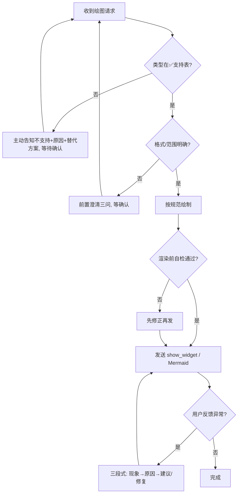

# 能力边界、前置澄清与异常处理

> 配套 `SKILL.md` 的「异常处理与主动提示」章节。本文件为可执行清单：
> 动手绘制前先过「前置澄清」与「能力边界」，绘制后过「渲染自检」，
> 一旦越界或出错，**主动、明确地告知用户**（哪里错 + 原因 + 修复/替代建议），绝不静默失败。

---

## 一、能力边界矩阵（先确认类型在不在表里）

### ✅ 直接支持（请直接绘制）

| 类别 | 内联 SVG（show_widget） | Mermaid 代码块 |
|------|--------------------------|----------------|
| 系统 / 分层架构图 | ✅ | — |
| 微服务 / 云原生架构图 | ✅ | — |
| 网络拓扑图 | ✅ | — |
| 业务流程图 / 泳道图 / 决策菱形 | ✅ | ✅ flowchart |
| 数据流图 | ✅ | ✅ flowchart |
| 时序图 | ✅ | ✅ sequenceDiagram |
| 状态机图 | ✅ | ✅ stateDiagram-v2 |
| ER 图 | ✅ | ✅ erDiagram |
| 类图 | — | ✅ classDiagram |
| 通用关系图 | ✅ | ✅ graph |
| 甘特图 | — | ✅ gantt |

### ❌ 不直接支持（不要硬画，主动告知并给替代）

| 用户想要 | 为什么不支持 | 应主动建议的替代方案 |
|----------|--------------|----------------------|
| 饼图 / 柱状图 / 折线图等统计图表 | 属数据可视化，非结构图 | 改用 Visualizer 的 `chart` 模块（Chart.js） |
| 思维导图（mindmap） | 当前未纳入支持清单 | Mermaid `mindmap`（若环境支持）或先拆成层级架构图 |
| 3D 图 / 地理地图 / 平面图 | 超出 SVG 2D 结构图范围 | 明确告知不在能力范围，建议专用工具 |
| 直接导出 PNG / PDF 文件 | 本 skill 产出 SVG 代码或 Mermaid 文本 | 说明可交付 SVG 源码让用户自行导出；或渲染后由宿主截图 |
| 反向工程（由图生成代码/文档） | 单向：文字→图 | 明确告知仅支持「需求→图」方向 |

> **硬规则**：凡用户请求落在 ❌ 区，**第一句话就必须说明「X 暂不直接支持 + 原因 + 建议改用 Y」**，
> 然后停下来等用户确认，绝不硬套 SVG 强行画一个「四不像」。

---

## 二、前置澄清三问（格式 / 类型 / 范围不清时必问）

动手前若以下任一项不明确，**用不超过 3 个选项的提问确认**，不要猜：

1. **输出形态**：内联图（对话中直接看，show_widget）｜ Mermaid 代码块（贴进文档）｜ SVG 源码文件（自行保存/导出）？
2. **图表类型**：用户说的是以上 ✅ 表的哪一种？概念有歧义时复述确认（如「你说的是业务流程图，对吗？」）。
3. **范围与粒度**：画整体还是某个模块？节点上限建议 ≤20，超出先提议拆分。

> 仅在用户意图、类型、输出形态都明确时才直接开画；**「先理解，再绘制」优先于「先出图」**。

---

## 三、渲染前自检清单（发送 show_widget 前逐条核对）

- [ ] SVG 以 `<svg>` 开头，viewBox 为 `0 0 680 <height>`，宽度固定 680。
- [ ] **不含** `<!DOCTYPE>`、`<html>`、`<head>`、`<body>` 标签。
- [ ] 箭头 marker 的 `markerWidth/markerHeight ≥ viewBox 宽高`，否则箭头会被裁切。
- [ ] 箭头尖端 10px 禁区内无文字；文字与连线 ≥6px 净空（必要时先画白底衬底）。
- [ ] 节点间距 ≥16px，文字与边框 ≥8px。
- [ ] 中文标签使用 `font-family="sans-serif"`。
- [ ] Mermaid 语法关键字拼写正确（注意 `gantt` 非 `gantt` 之外的常见错，如 `sequencediagram` 应为 `sequenceDiagram`）。

> 自检任一项不过，**先改再发**，不要发一个已知有缺陷的图让用户自己排查。

---

## 四、出错时的标准话术（主动、明确、可行动）

当用户需求越界、格式错误或渲染异常时，按「**现象 → 原因 → 建议**」三段式回复，例如：

- **类型不支持**：
  > 「你想要的是饼图，这属于统计图表，本 skill 不直接支持（它专注架构/流程等结构图）。
  > 建议改用图表模块（Chart.js）来画；如果你要的是占比可视化，我也可以帮你整理成数据后出图。」
- **格式不清**：
  > 「在动手前我需要先确认两点：① 你想要的是内联图还是 Mermaid 代码块贴进文档？② 这是业务流程图还是时序图？
  > 确认后我立刻画，避免画错方向。」
- **渲染异常（如箭头被裁切 / 文字被压）**：
  > 「刚出的图有两个问题：① 箭头 marker 尺寸小于视口被裁掉一半；② 节点标签压在了连线上。
  > 我已将 marker 的 markerWidth/Height 调大、并给文字加了白底衬底，已重发修正版。」
- **引用文件缺失 / 语法错误**：
  > 「绘制失败，原因是 Mermaid 关键字 `sequencediagram` 拼写有误（正确为 `sequenceDiagram`）。
  > 已修正并重发。」

> **核心原则**：用户不需要自己排查。任何异常都由 agent 定位、解释并修复/给出替代，再继续。

---

## 五、决策流（越界/异常判断）

