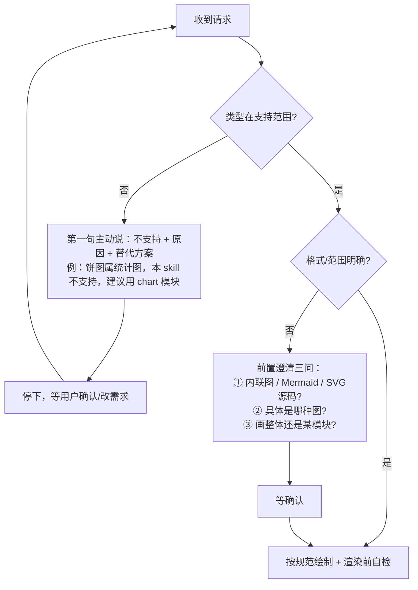

# 常见问题解答（FAQ）

> 配套 `SKILL.md` 与 `references/diagram-types.md`。遇到拿不准的情况，先在这查；
> 本文件同时固化「**请求超出能力范围时怎么办**」，避免你踩坑或得到一张错图。

---

## 一、能力范围类

**Q1：我想画饼图 / 柱状图 / 折线图，怎么弄？**
A：这属于**统计图表（数据可视化）**，不在本 skill 的结构图能力范围内。
请改用 Visualizer 的 `chart` 模块（Chart.js）来画；如果你已有数据，我可以先帮你整理成可直接出图的格式。

**Q2：能画思维导图（mindmap）吗？**
A：当前未纳入支持清单。两种替代：① 若环境支持 Mermaid `mindmap`，我用代码块给你；② 更稳妥的是先拆成「层级架构图」，结构更清晰也更符合本 skill 的强项。

**Q3：能画 3D 图 / 地理地图 / 室内平面图吗？**
A：不能，超出 SVG 2D 结构图范围。这类请使用专用建模 / 地图 / CAD 工具，本 skill 仅做架构、流程、时序、状态、ER、类图、甘特等结构图。

**Q4：能直接导出 PNG / PDF 文件吗？**
A：本 skill 产出的是 **SVG 源码**或 **Mermaid 文本**，不直接落盘成图片文件。
你可以：① 复制 SVG 源码自行在编辑器 / 工具里导出；② 由宿主渲染后截图保存。

**Q5：能根据一张图反向生成代码或文档吗？**
A：不能，本 skill 是单向的「需求 → 图」。反向工程请用专用工具。

---

## 二、格式与输出类

**Q6：我该要「内联图」还是「Mermaid 代码块」？**
A：看用途——对话里直接看效果选**内联图（show_widget）**；要贴进 Markdown 文档 / 让他人二次编辑选 **Mermaid 代码块**。不确定就告诉我用途，我帮你选。

**Q7：Mermaid 关键字总拼错（如 `sequencediagram`），有速查吗？**
A：有，见 `references/mermaid-cheatsheet.md`。常见易错：`sequenceDiagram`（不是 sequencediagram）、`stateDiagram-v2`、`gantt`。

**Q8：图太复杂、节点很多，一次画不完？**
A：单张图建议 ≤20 节点。超出请**拆成多张图**，每张一个聚焦视角，配合文字说明串成完整叙述。

---

## 三、渲染异常类（自己或用户发现图不对时）

**Q9：箭头只剩一半 / 方向反了，为什么？**
A：几乎都是 `marker` 尺寸问题——`markerWidth/markerHeight` 必须 **≥ viewBox 宽高**，否则被视口裁切；方向则靠 `orient="auto"` 自动旋转，marker 路径本身要朝右（+x）。

**Q10：文字被箭头 / 连线压住了，怎么修？**
A：箭头尖端 10px 禁区内不要放文字；凡文字可能与线共区，先画一个 `fill="#ffffff"` 矩形衬底再写字。详见 `references/arrow-text-clearance-guide.md`。

**Q11：中文显示成方块 / 乱码？**
A：根 `<svg>` 必须带 `font-family="sans-serif"`（注意是 sans，不是 sans-serif 也可，但需无衬线），并确保环境有中文字体。

**Q12：图被裁掉一部分 / 底部元素不见了？**
A：分两种情况，报错信息能直接区分：
- **渲染器直接拒绝（最常见也最省心）**：若 viewBox 宽度 ≠ 680，或 widget_code 含 `<!DOCTYPE>`/`<html>`/`<head>`/`<body>`，渲染器会**直接报错拦截**、不出图，典型提示如 `SVG widget_code must use a 680px-wide viewBox`。这类不是「图被裁」，而是**硬规则违反**，照提示改对即可，无需排查布局。
- **图渲染出来了但底部被裁**：viewBox **高度**算小了。规则是「所有内容底部坐标 + 图例高度 + 16px 余量」再取整，宁大勿小。

---

## 四、请求越界时怎么办（重要）

当用户的需求**不在支持范围内**，或**格式 / 范围不清**时，按以下路径处理，**不要硬画**：

> 核心：**用户不需要自己排查**。任何异常都由 agent 定位 → 解释（现象→原因）→ 修复或给替代，再继续。

---

## 五、快速自查（动手前 10 秒）

- [ ] 类型在 ✅ 支持表？（不在 → 走第四节路径）
- [ ] 输出形态 / 图表类型 / 范围 都明确？（不清 → 澄清三问）
- [ ] viewBox 宽度 = 680、无 DOCTYPE/html 标签？
- [ ] marker 尺寸 ≥ 视口、箭头禁区无字、中文 `sans-serif`？
- [ ] 节点 ≤20，超了已计划拆分？
